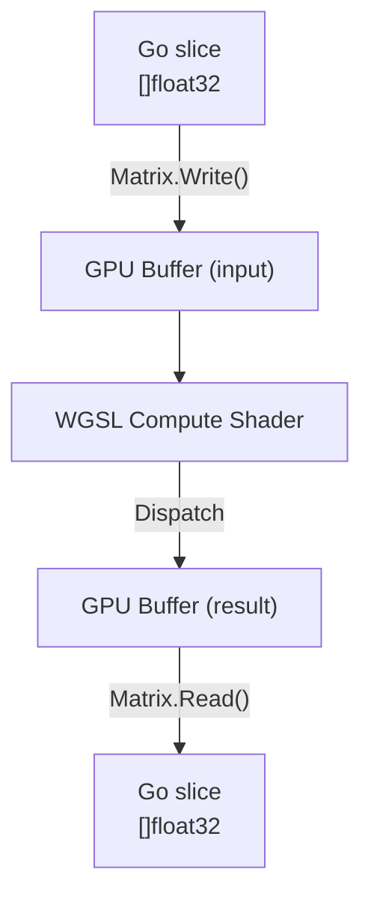

# go-wgpu-mat

GPU-accelerated 2D matrix operations for Go, powered by
[gogpu/wgpu](https://github.com/gogpu/wgpu).

> **One thing, done well** — fast matrix math on the GPU,
> simple Go-idiomatic API, no C compiler required.

Designed to accelerate
[go-microgpt](https://github.com/KEINOS/go-microgpt)
(a Go port of Andrej Karpathy's microGPT), where matrix
multiply is the kernel hot path.

## Scope

In scope:

- 2D `float32` matrix operations: `MatMul`, `Add`, `Scale`, `Transp`
- Reduction: row-wise `ReduceSum`, `ReduceMax`
- Neural-net ops: `Softmax`, `RMSNorm`
- Simple, explicit API — no hidden allocations

Out of scope:

- Full tensor library or automatic differentiation
- Graphics and rendering pipelines
- Training algorithms or model management
- `float16` / `bfloat16` (planned for a future milestone)

## How it works



## Installation

Requires Go 1.25+. No C compiler needed —
`gogpu/wgpu` is Pure Go.

```sh
go get github.com/KEINOS/go-wgpu-mat/mat
```

Backend packages are registered internally by `mat`, so user code
does not need blank imports.

Build (CGo must be disabled — required by `gogpu/wgpu`):

```sh
CGO_ENABLED=0 go build ./...
```

## Quickstart

```go
package main

import (
  "fmt"

  "github.com/KEINOS/go-wgpu-mat/mat"
)

func main() {
  // UseGPU (default) or UseCPU
  ctx, err := mat.NewContext(mat.UseGPU)
    if err != nil {
        panic(err)
    }
    defer ctx.Release()

    // 2×2 matrices stored on the GPU
    a, _ := mat.NewMatrix(ctx, 2, 2)
    b, _ := mat.NewMatrix(ctx, 2, 2)
    c, _ := mat.NewMatrix(ctx, 2, 2)
    defer a.Release()
    defer b.Release()
    defer c.Release()

    // Upload data (row-major order)
    a.Write([]float32{1, 2, 3, 4}) // [[1,2],[3,4]]
    b.Write([]float32{5, 6, 7, 8}) // [[5,6],[7,8]]

    // Compute C = A × B on the GPU
    if err := mat.MatMul(a, b, c); err != nil {
        panic(err)
    }

    // Read result back to CPU
    data, _ := c.Read()
    fmt.Println(data) // [19 22 43 50]
}
```

## API

```go
// Context manages the WGPU instance, adapter, and device.
type Context struct{ ... }

type ContextMode uint8
const (
  UseGPU ContextMode = iota
  UseCPU
)

func NewContext(modes ...ContextMode) (*Context, error)
func (c *Context) Release()

// Matrix is a 2D float32 array stored on the GPU.
type Matrix struct { Rows, Cols int; ... }

func NewMatrix(ctx *Context, rows, cols int) (*Matrix, error)
func (m *Matrix) Write(data []float32) error
func (m *Matrix) Read() ([]float32, error)
func (m *Matrix) Release()

// Operations — return error on dimension mismatch (no panics).
func MatMul(a, b, out *Matrix) error      // out = A × B
func Add(a, b, out *Matrix) error         // out = A + B
func Scale(a *Matrix, s float32, out *Matrix) error
func Transp(a, out *Matrix) error         // out = Aᵀ
func ReduceSum(a, out *Matrix) error      // row-wise sum
func ReduceMax(a, out *Matrix) error      // row-wise max
func Softmax(a, out *Matrix) error        // row-wise
func RMSNorm(a, out *Matrix) error        // row-wise
```

## Data layout

- **Row-major**: element `(r, c)` is at index `r*cols + c`.
- **Precision**: `float32` (IEEE-754 single precision).
  `float16` is planned for a future milestone.
- **Alignment**: 4-byte (float32). Storage buffers require no
  extra padding unless a GPU limit demands it.

## Concurrency

- Each operation submits GPU commands asynchronously. The CPU
  returns immediately after submission.
- Results are synchronized on `Matrix.Read()`, which maps the
  GPU buffer back to the host and waits for completion.
- `Device.Queue()` is safe to call from multiple goroutines.
  Do not write to the same GPU buffer from two goroutines at once.

## Development

### VS Code Setup

The repository includes a `.vscode/` configuration directory that
automatically sets up the Go environment:

- **`settings.json`**: Sets `CGO_ENABLED=0` globally, enables
  format-on-save, and configures linting
- **`launch.json`**: Provides debug configurations for running tests

Simply open the folder in VS Code — no additional configuration needed.
Pre-configured test runners are available via the Debug menu.

## Testing

`CGO_ENABLED=0` is required (enforced via `//go:build !cgo` on all
source files). Use the Makefile targets for convenience:

```sh
make test   # CGO_ENABLED=0 go test -cover ./...
make lint   # CGO_ENABLED=0 golangci-lint run --fix
make bench  # CGO_ENABLED=0 go test -run=^$ -bench=. -benchmem ./mat/...
make fuzz   # runs both fuzzers in ./mat for 10s each
```

Or run manually:

```sh
CGO_ENABLED=0 go test -cover ./...

# With HTML coverage report
CGO_ENABLED=0 go test -coverprofile=cov.out ./...
go tool cover -html=cov.out
```

GPU results are compared to a CPU reference. Tolerances:

- Most operations: `|gpu − cpu| < 1e-5`
- `Softmax`: `|gpu − cpu| < 1e-4`

## References

- [gogpu/wgpu](https://github.com/gogpu/wgpu) — Pure Go WebGPU
- [WGSL spec](https://www.w3.org/TR/WGSL/) — compute shader language
- [go-microgpt](https://github.com/KEINOS/go-microgpt) — target
  application

## License

- MIT
- Copyright (c) 2026 KEINOS and go-wgpu-mat contributors
