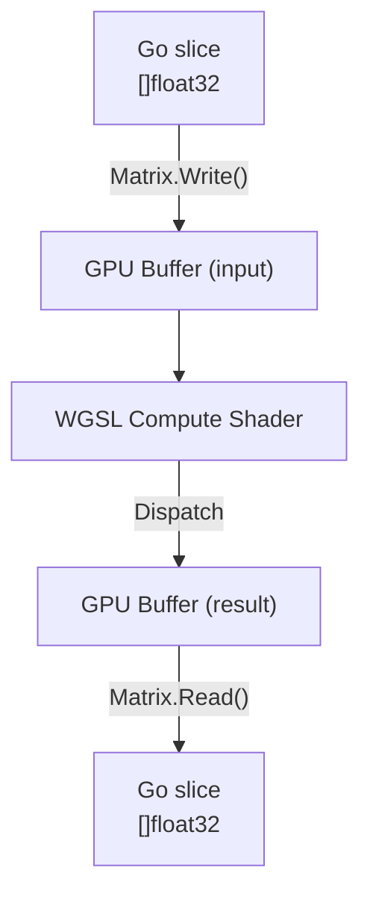

# go-wgpu-mat

GPU-accelerated 2D matrix operations for Go, powered by
[gogpu/wgpu](https://github.com/gogpu/wgpu).

> **One thing, done well** — fast matrix math on the GPU,
> simple Go-idiomatic API, no C compiler required.

Designed to accelerate
[go-microgpt](https://github.com/KEINOS/go-microgpt)
(a Go port of Andrej Karpathy's microGPT), where matrix
multiply is the kernel hot path.

## Scope

In scope:

- 2D `float32` matrix operations: `MatMul`, `Add`, `Scale`, `Transp`
- Reduction: row-wise `ReduceSum`, `ReduceMax`
- Neural-net ops: `Softmax`, `RMSNorm`
- Simple API with explicit matrix and context ownership

Out of scope:

- Full tensor library or automatic differentiation
- Graphics and rendering pipelines
- Training algorithms or model management
- `float16` / `bfloat16` (planned for a future milestone)

## How it works


```mermaid
flowchart TB
    A["Go slice\n[]float32"]
    A -->|"Matrix.Write()"| B["GPU Buffer (input)"]
    B --> C["WGSL Compute Shader"]
    C -->|"Dispatch"| D["GPU Buffer (result)"]
    D -->|"Matrix.Read()"| E["Go slice\n[]float32"]
```

`MatMul` and non-aliased, same-context `Add` execute through WGSL compute
shaders and leave their results in the output device buffer until `Read` is
called. Operations not yet kernelized use
the compatibility path: read device buffers to the host, compute in Go, and
write the result back. That distinction is intentional and will be removed one
operation at a time as kernels are added.

## Installation

Requires Go 1.25+. `gogpu/wgpu` supports builds with CGO enabled or disabled.
A C compiler is not needed when building with `CGO_ENABLED=0`.

```sh
go get github.com/KEINOS/go-wgpu-mat/mat
```

Backend packages are registered internally by `mat`, so user code
does not need blank imports.

Build in either mode:

```sh
CGO_ENABLED=0 go build ./...
CGO_ENABLED=1 go build ./...
```

## Quickstart

```go
package main

import (
  "fmt"

  "github.com/KEINOS/go-wgpu-mat/mat"
)

func main() {
  // Helper function to handle error
  panicOnErr := func(err error) {
    if err != nil {
      panic(err)
    }
  }

  // UseGPU (default) or UseCPU
  ctx, err := mat.NewContext(mat.UseGPU)
  panicOnErr(err)

  defer ctx.Release()

  // 2×2 matrices stored on the GPU
  a, err := mat.NewMatrix(ctx, 2, 2)
  panicOnErr(err)

  b, err := mat.NewMatrix(ctx, 2, 2)
  panicOnErr(err)

  c, err := mat.NewMatrix(ctx, 2, 2)
  panicOnErr(err)

  defer a.Release()
  defer b.Release()
  defer c.Release()

  // Upload data (row-major order)
  err = a.Write([]float32{1, 2, 3, 4}) // [[1,2],[3,4]]
  panicOnErr(err)
  err = b.Write([]float32{5, 6, 7, 8}) // [[5,6],[7,8]]
  panicOnErr(err)

  // Compute C = A × B on the GPU
  err = mat.MatMul(a, b, c)
  panicOnErr(err)

  // Read result back to CPU
  data, err := c.Read()
  panicOnErr(err)

  fmt.Println(data)
  // Output:
  // [19 22 43 50]
}
```

## API

```go
// Context manages the WGPU instance, adapter, and device.
type Context struct{ ... }

type ContextMode uint8
const (
  UseGPU ContextMode = iota
  UseCPU
)

func NewContext(modes ...ContextMode) (*Context, error)
func (c *Context) Release()

// Matrix is a 2D float32 array stored on the GPU.
type Matrix struct { Rows, Cols int; ... }

func NewMatrix(ctx *Context, rows, cols int) (*Matrix, error)
func (m *Matrix) Write(data []float32) error
func (m *Matrix) Read() ([]float32, error)
func (m *Matrix) Release()

// Operations — return error on dimension mismatch (no panics).
func MatMul(a, b, out *Matrix) error      // out = A × B
func Add(a, b, out *Matrix) error         // out = A + B
func Scale(a *Matrix, s float32, out *Matrix) error
func Transp(a, out *Matrix) error         // out = Aᵀ
func ReduceSum(a, out *Matrix) error      // row-wise sum
func ReduceMax(a, out *Matrix) error      // row-wise max
func Softmax(a, out *Matrix) error        // row-wise
func RMSNorm(a, out *Matrix) error        // row-wise
```

## Data layout

- **Row-major**: element `(r, c)` is at index `r*cols + c`.
- **Precision**: `float32` (IEEE-754 single precision).
  `float16` is planned for a future milestone.
- **Alignment**: 4-byte (float32). Storage buffers require no
  extra padding unless a GPU limit demands it.

## Concurrency

- Each operation submits GPU commands asynchronously. The CPU
  returns immediately after submission.
- Results are synchronized on `Matrix.Read()`, which maps the
  GPU buffer back to the host and waits for completion.
- `Device.Queue()` is safe to call from multiple goroutines.
  Do not write to the same GPU buffer from two goroutines at once.

## Development

### VS Code Setup

The repository includes a `.vscode/` configuration directory that
automatically sets up the Go environment:

- **`settings.json`**: Enables format-on-save and configures linting
- **`launch.json`**: Provides debug configurations for running tests

Simply open the folder in VS Code — no additional configuration needed.
Pre-configured test runners are available via the Debug menu.

## Testing

Both CGO modes are supported and tested. Use the Makefile targets for
convenience:

```sh
make test   # coverage in both CGO modes; race detection with CGO_ENABLED=1
make lint   # lint Markdown and Go once; the test target covers both CGO modes
make bench  # benchmark using the current/default CGO mode
make bench-isolated # run each benchmark sample in a separate process
make fuzz   # runs both fuzzers in ./mat for 10s each
```

`make bench-isolated` preserves completed samples if a native GPU backend
crashes. It writes one log per process and a `combined.txt` file under a new
temporary directory. Configure it with `BENCH_PATTERN`, `BENCH_SAMPLES`,
`BENCH_TIME`, `BENCH_OUT`, and `CGO_ENABLED`. Benchmarks report both end-to-end
latency with a readback after every operation and device-resident latency with
one final synchronization.

On Go 1.26 and macOS arm64, the upstream Metal callback currently triggers a
checkptr false positive and intermittent autorelease-pool crashes under
`-race`. On that platform, `make test` keeps the race detector enabled for the
pure and mocked unit paths but skips real WGPU tests and examples; the preceding
CGO-disabled suite still exercises the real WGPU path without race
instrumentation. Other platforms, including Linux CI, run the complete
CGO-enabled suite with the race detector and default checkptr behavior.

The Go race detector requires CGO. The `CGO_ENABLED=0` path therefore runs
tests and coverage without `-race`. The `CGO_ENABLED=1` path runs the same
tests with the race detector enabled. Lint checks are independent of this test
matrix and run once.

Or run manually:

```sh
CGO_ENABLED=0 go test -cover ./...
CGO_ENABLED=1 go test -race -cover ./...

# Go 1.26 on macOS arm64 with the WGPU Metal integration
GOMAXPROCS=1 GO_WGPU_MAT_SKIP_GPU_TESTS=1 CGO_ENABLED=1 go test -race \
  -gcflags=all=-d=checkptr=0 -parallel=1 -run='^Test' -cover ./...

# With HTML coverage report
go test -coverprofile=cov.out ./...
go tool cover -html=cov.out
```

GPU results are compared to a CPU reference. Tolerances:

- Most operations: `|gpu − cpu| < 1e-5`
- `Softmax`: `|gpu − cpu| < 1e-4`

## References

- [gogpu/wgpu](https://github.com/gogpu/wgpu) — Pure Go WebGPU
- [WGSL spec](https://www.w3.org/TR/WGSL/) — compute shader language
- [go-microgpt](https://github.com/KEINOS/go-microgpt) — target
  application

## License

- MIT
- Copyright (c) 2026 KEINOS and go-wgpu-mat contributors
