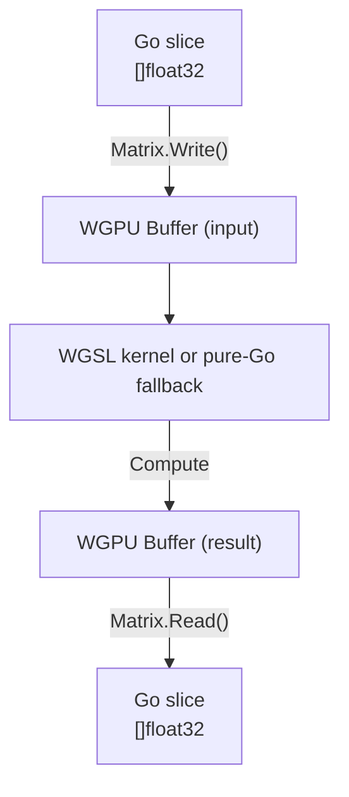

# go-wgpu-mat

GPU-accelerated 2D matrix operations for Go, powered by
[gogpu/wgpu](https://github.com/gogpu/wgpu).

> **One thing, done well** — fast matrix math on the GPU,
> simple Go-idiomatic API, no C compiler required.

Designed to accelerate
[go-microgpt](https://github.com/KEINOS/go-microgpt)
(a Go port of Andrej Karpathy's microGPT), where matrix
multiply is the kernel hot path.

## Scope

In scope:

- 2D `float32` matrix operations: `MatMul`, `Add`, `Mul`, `Scale`, `Transp`
- Shape operations: `BroadcastTo`, `ReduceSumTo`, `ReshapeTo`
- Reduction: row-wise `ReduceSum`, `ReduceMax`
- Neural-net ops: `Softmax`, `RMSNorm`
- Simple API with explicit matrix and context ownership

Out of scope:

- Full tensor library or automatic differentiation
- Graphics and rendering pipelines
- Training algorithms or model management
- `float16` / `bfloat16` (planned for a future milestone)

## How it works


```mermaid
flowchart TB
    A["Go slice\n[]float32"]
    A -->|"Matrix.Write()"| B["WGPU Buffer (input)"]
    B --> C["WGSL kernel or pure-Go fallback"]
    C -->|"Compute"| D["WGPU Buffer (result)"]
    D -->|"Matrix.Read()"| E["Go slice\n[]float32"]
```

`MatMul`, `Add`, `Mul`, `Scale`, `Transp`, `ReduceSum`, `ReduceSumTo`,
`BroadcastTo`, and `ReshapeTo` execute through WGSL compute shaders when a GPU
is available. `Add` and `Mul` support 2D broadcasting. If the adapter is
detected as a CPU or software adapter (e.g., on CI without GPU hardware), these
operations fall back to a pure-Go CPU implementation. The result remains in the
output WGPU buffer until `Read` is called.

`ReduceMax`, `Softmax`, and `RMSNorm` currently use the compatibility path: read
device buffers to the host, compute in Go, and write the result back.

## Installation

Requires Go 1.25+. `gogpu/wgpu` supports builds with CGO enabled or disabled.
A C compiler is not needed when building with `CGO_ENABLED=0`.

```sh
go get github.com/KEINOS/go-wgpu-mat/mat
```

Backend packages are registered internally by `mat`, so user code
does not need blank imports.

Build in either mode:

```sh
CGO_ENABLED=0 go build ./...
CGO_ENABLED=1 go build ./...
```

## Quickstart

```go
package main

import (
  "fmt"

  "github.com/KEINOS/go-wgpu-mat/mat"
)

func main() {
  // Helper function to handle error
  panicOnErr := func(err error) {
    if err != nil {
      panic(err)
    }
  }

  // UseAuto (default) or UseGPU or UseCPU
  ctx, err := mat.NewContext()       // UseAuto — try GPU, then CPU adapter
  panicOnErr(err)

  defer ctx.Release()

  // 2×2 matrices stored in WGPU buffers owned by the selected adapter
  a, err := mat.NewMatrix(ctx, 2, 2)
  panicOnErr(err)

  b, err := mat.NewMatrix(ctx, 2, 2)
  panicOnErr(err)

  c, err := mat.NewMatrix(ctx, 2, 2)
  panicOnErr(err)

  defer a.Release()
  defer b.Release()
  defer c.Release()

  // Upload data (row-major order)
  err = a.Write([]float32{1, 2, 3, 4}) // [[1,2],[3,4]]
  panicOnErr(err)
  err = b.Write([]float32{5, 6, 7, 8}) // [[5,6],[7,8]]
  panicOnErr(err)

  // Compute C = A × B with the selected adapter
  err = mat.MatMul(a, b, c)
  panicOnErr(err)

  // Read result back to CPU
  data, err := c.Read()
  panicOnErr(err)

  fmt.Println(data)
  // Output:
  // [19 22 43 50]
}
```

## API

```go
// Context manages the WGPU instance, adapter, and device.
type Context struct{ ... }

type ContextMode uint8
const (
  UseGPU ContextMode = iota
  UseCPU
  UseAuto
)
func (m ContextMode) String() string

func NewContext(modes ...ContextMode) (*Context, error)
func (c *Context) Release()
func (c *Context) Close() error
func (c *Context) Mode() ContextMode
func (c *Context) Released() bool
func (c *Context) Stats() Stats

// Stats is a concurrency-safe snapshot of context activity.
type Stats struct {
  HostReadCount           uint64
  HostReadBytes           uint64
  HostWriteCount          uint64
  HostWriteBytes          uint64
  ComputeSubmissionCount  uint64
  ReadbackSubmissionCount uint64
  MatrixAllocationCount   uint64
  MatrixReleaseCount      uint64
  LiveMatrixBytes         uint64
  PeakLiveMatrixBytes     uint64
}

// Shape is an immutable-by-copy matrix shape.
type Shape struct { ... }

func (s Shape) Rows() int
func (s Shape) Cols() int
func (s Shape) Len() int
func (s Shape) String() string

// Matrix is a 2D float32 array stored in a WGPU buffer.
// Its shape is fixed at construction time.
type Matrix struct { ... }

func NewMatrix(ctx *Context, rows, cols int) (*Matrix, error)
func (m *Matrix) Rows() int
func (m *Matrix) Cols() int
func (m *Matrix) Shape() Shape
func (m *Matrix) Len() int
func (m *Matrix) Write(data []float32) error
func (m *Matrix) Read() ([]float32, error)
func (m *Matrix) Release()
func (m *Matrix) Close() error
func (m *Matrix) Released() bool
func (m *Matrix) String() string

// Operations — return error on dimension mismatch (no panics).
func MatMul(a, b, out *Matrix) error      // out = A × B
func Add(a, b, out *Matrix) error         // 2D broadcast: out = A + B
func Mul(a, b, out *Matrix) error         // 2D broadcast: out = A * B
func Scale(a *Matrix, s float32, out *Matrix) error
func Transp(a, out *Matrix) error         // out = Aᵀ
func ReduceSum(a, out *Matrix) error      // row-wise sum
func ReduceSumTo(a, out *Matrix) error    // reduce singleton out axes
func BroadcastTo(a, out *Matrix) error    // expand singleton input axes
func ReshapeTo(a, out *Matrix) error      // equal-length device copy
func ReduceMax(a, out *Matrix) error      // row-wise max
func Softmax(a, out *Matrix) error        // row-wise
func RMSNorm(a, out *Matrix) error        // row-wise
```

Matrix shapes are immutable. Every operation requires all operands to belong
to the same `Context`, and `out` must be distinct from every input. These
uniform rules keep execution predictable as more operations are kernelized.
`Context.Stats` can verify that a sequence remains device-resident: compare
snapshots around the sequence and check that the host-transfer fields and
`ReadbackSubmissionCount` did not change while `ComputeSubmissionCount`
increased. Internal uniform uploads are not counted as host writes.
Matrix allocation, release, current-live, and peak-live fields count public
`Matrix` buffers and bytes only; transient uniform and readback staging buffers
are excluded.

Validation and lifecycle errors support `errors.Is`:

```go
err := mat.MatMul(a, b, out)
if errors.Is(err, mat.ErrDimensionMismatch) {
  // Inspect the error text for the actual and expected shapes.
}
```

Other sentinels include `ErrNilContext`, `ErrContextNotInitialized`,
`ErrContextReleased`, `ErrInvalidMode`, `ErrBackendUnavailable`,
`ErrNotInitialized`, `ErrReleased`, `ErrInvalidState`, `ErrInvalidDimension`,
`ErrLengthMismatch`, `ErrContextMismatch`, `ErrAliasedOutput`, `ErrOverflow`,
`ErrDeviceLimit`, and `ErrKernelLimit`.

## Data layout

- **Row-major**: element `(r, c)` is at index `r*m.Cols() + c`.
- **Precision**: `float32` (IEEE-754 single precision).
  `float16` is planned for a future milestone.
- **Alignment**: 4-byte (float32). Storage buffers require no
  extra padding unless a GPU limit demands it.

## Concurrency

- Kernelized GPU operations submit commands asynchronously. Host compatibility
  paths and CPU fallback operations complete synchronously.
- Results are synchronized on `Matrix.Read()`, which maps the
  GPU buffer back to the host and waits for completion.
- `Device.Queue()` is safe to call from multiple goroutines.
  Do not write to the same GPU buffer from two goroutines at once.
- `Release`/`Close` must not run concurrently with operations. Release matrices
  before releasing their `Context`.

## Development

### VS Code Setup

The repository includes a `.vscode/` configuration directory that
automatically sets up the Go environment:

- **`settings.json`**: Enables format-on-save and configures linting
- **`launch.json`**: Provides debug configurations for running tests

Simply open the folder in VS Code — no additional configuration needed.
Pre-configured test runners are available via the Debug menu.

## Testing

Both CGO modes are supported and tested. Use the Makefile targets for
convenience:

```sh
make test   # coverage in both CGO modes; race detection with CGO_ENABLED=1
make lint   # lint Markdown and Go once; the test target covers both CGO modes
make bench  # benchmark using the current/default CGO mode
make bench-isolated # run each benchmark sample in a separate process
make fuzz   # runs both fuzzers in ./mat for 10s each
```

`make bench-isolated` preserves completed samples if a native GPU backend
crashes. It writes one log per process and a `combined.txt` file under a new
temporary directory. Configure it with `BENCH_PATTERN`, `BENCH_SAMPLES`,
`BENCH_TIME`, `BENCH_OUT`, and `CGO_ENABLED`. Benchmarks report both end-to-end
latency with a readback after every operation and device-resident latency with
one final synchronization.

The Go race detector requires CGO. `make test` runs the `CGO_ENABLED=0` suite
first (without race instrumentation) and the `CGO_ENABLED=1` suite second
(with race detection). These suites use the deterministic CPU adapter. Hardware
Metal execution is kept out of the race-instrumented process because upstream
Metal FFI can crash under race instrumentation. Lint checks are independent and
run once.

Run the required local hardware gate separately. It must not skip or fall back,
and its coverage profile reaches 100% on a Metal-capable machine:

```sh
GO_WGPU_MAT_GPU=1 CGO_ENABLED=1 go test -count=1 -parallel=1 -cover ./...
```

CPU-only CI may report lower coverage because default hardware dependency
wiring is intentionally exercised only by the hardware gate.

Or run manually:

```sh
CGO_ENABLED=0 go test -cover ./...
CGO_ENABLED=1 go test -race -cover ./...

# With HTML coverage report
go test -coverprofile=cov.out ./...
go tool cover -html=cov.out
```

Operation results are compared to pure-Go reference implementations.
Test tolerances:

- Most individual operations: `|gpu − cpu| ≤ 1e-5`
- `Softmax`, `RMSNorm`, and multi-operation device-resident chains:
  `|gpu − cpu| ≤ 1e-4`

## References

- [gogpu/wgpu](https://github.com/gogpu/wgpu) — Pure Go WebGPU
- [WGSL spec](https://www.w3.org/TR/WGSL/) — compute shader language
- [go-microgpt](https://github.com/KEINOS/go-microgpt) — target
  application

## License

- MIT
- Copyright (c) 2026 KEINOS and go-wgpu-mat contributors
